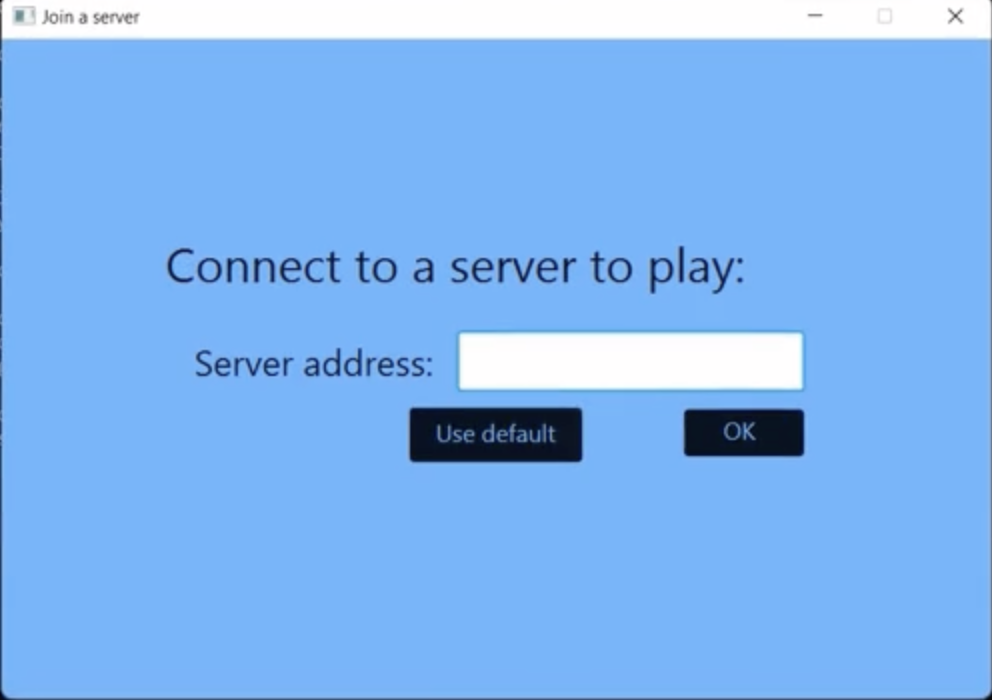
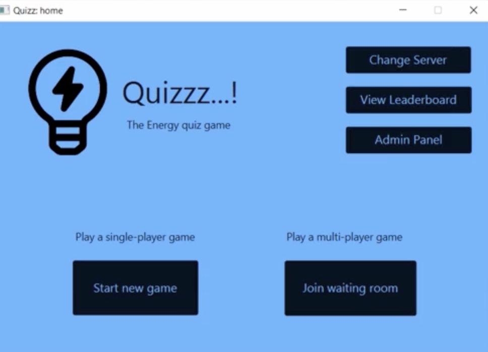
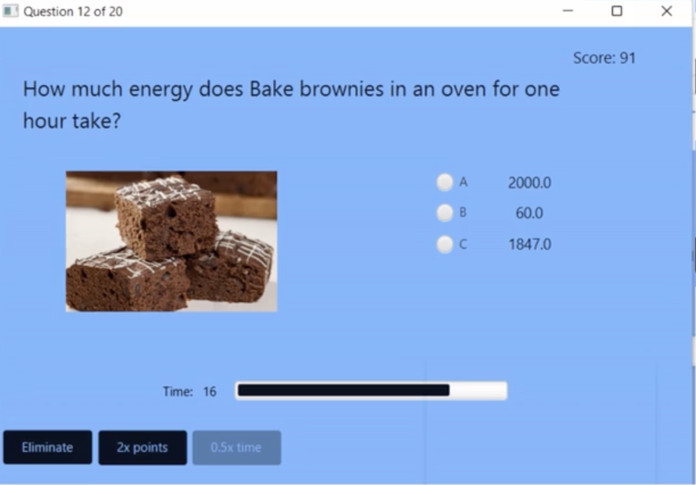
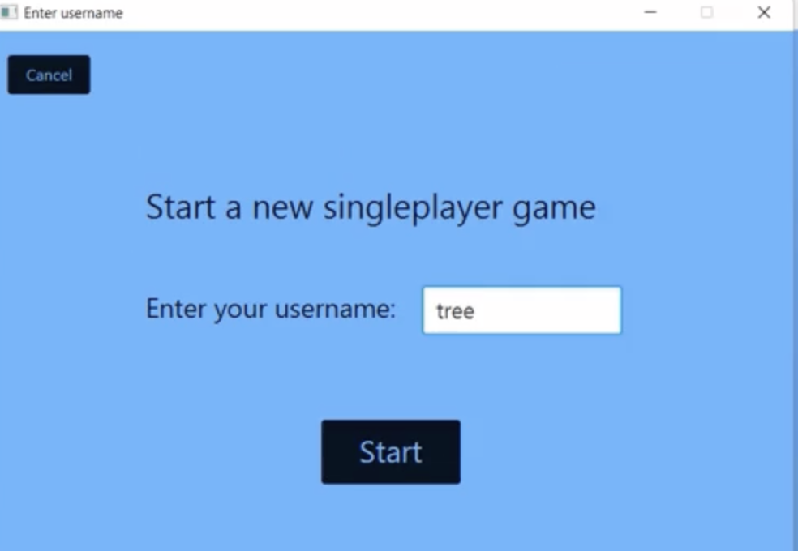
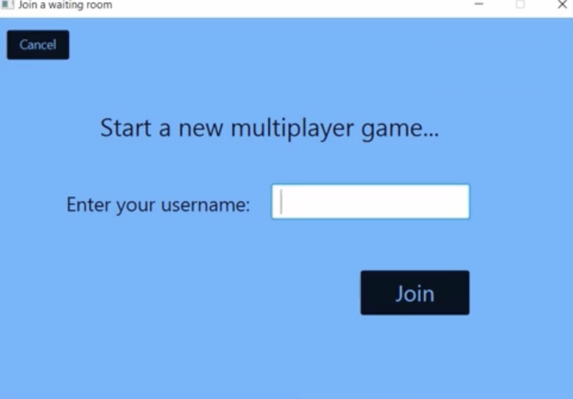
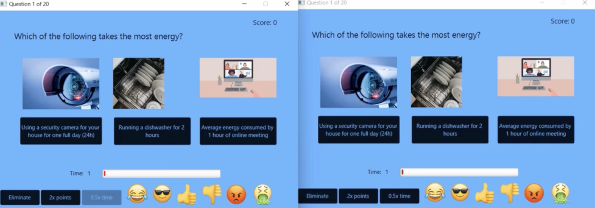
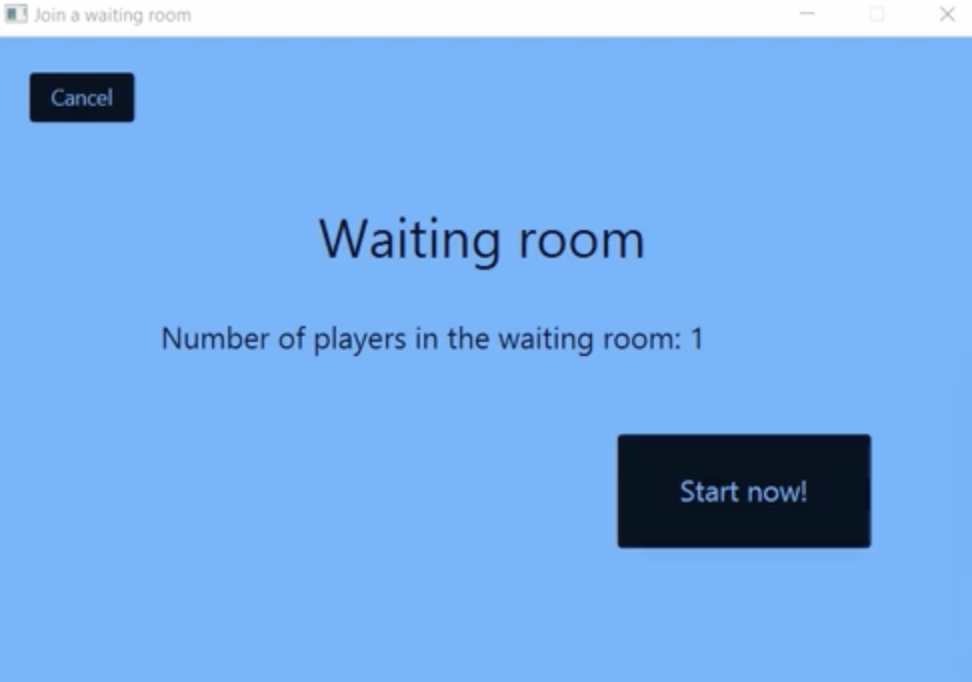
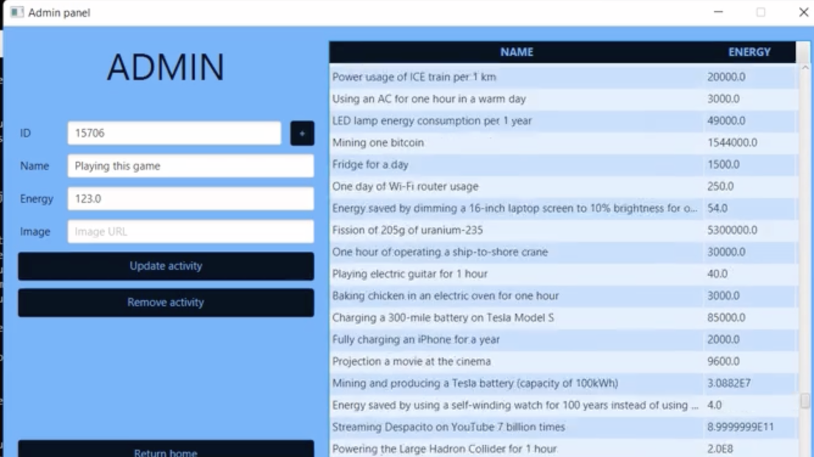
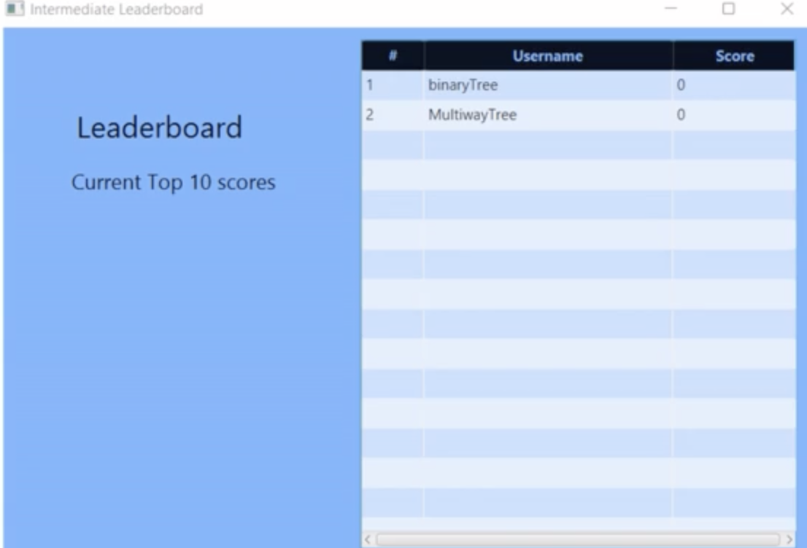
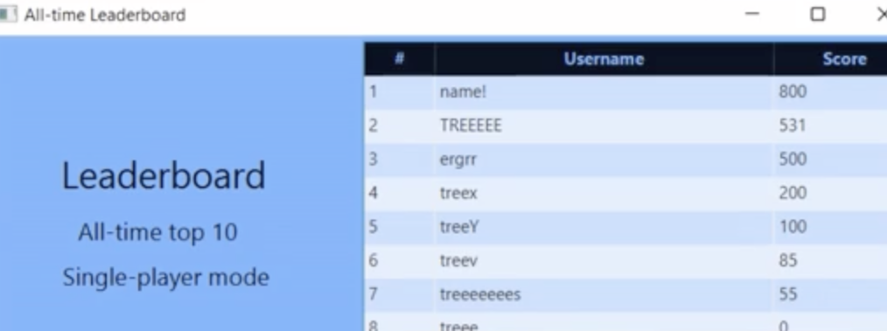

# Quizzzz

## Description of project

Quizzzz is a quiz game focused on increasing the energy awareness by letting the player guess amounts of energy used
by various everyday (and not only) activities. You can play alone or compete with your friends.

The game features 4 different types of questions:
- guessing which of 3 activities takes the most amount of energy
- estimating the amount of energy an activity takes
- estimating the amount of energy an activity takes, choosing from 3 possible answers
- comparing 2 different activities

## How to run it

### Prerequisites
- Windows or Linux operating system (may work on other systems, but we do not guarantee)
- Java 17 (with JavaFX) installed on the device
- Git installed on the device
- access to this Gitlab repository

### Steps for running the server
1. Clone this repository on your local machine.
```
git clone git@gitlab.ewi.tudelft.nl:cse1105/2021-2022/team-repositories/oopp-group-22/repository-template.git
```

2. Download the Activity Bank artifact with all activities. You can find more information about it in `importer/README.md` document.
In the rest of this document it is assumed that the activities are downloaded into a directory called `activities`,
located next to the cloned repository directory. The `activities` folder should contain directories from `00` to `78`
and file `activities.json`, according to the Activity Bank format.

3. Enter the cloned repository directory.
```
cd repository-template
```

4. Run the server using Gradle.
```
./gradlew :server:run
```

5. Import activities from the Activity Bank. You can find more details about it in `importer/README.md` document.
```
./gradlew :importer:run --args "http://localhost:8080 ../../activities -D"
```

### Steps for running the client
1. Clone this repository on your local machine (skip if already done).
```
git clone git@gitlab.ewi.tudelft.nl:cse1105/2021-2022/team-repositories/oopp-group-22/repository-template.git
```

2. Enter the cloned repository directory.
```
cd repository-template
```

3. Run the client using Gradle.
```
./gradlew :client:run
```

4. After the application opens, click `Use default` to connect to the local server
(localhost:8080, the server must be running) or enter IP address (along with port number) of another server.


### DEMO











